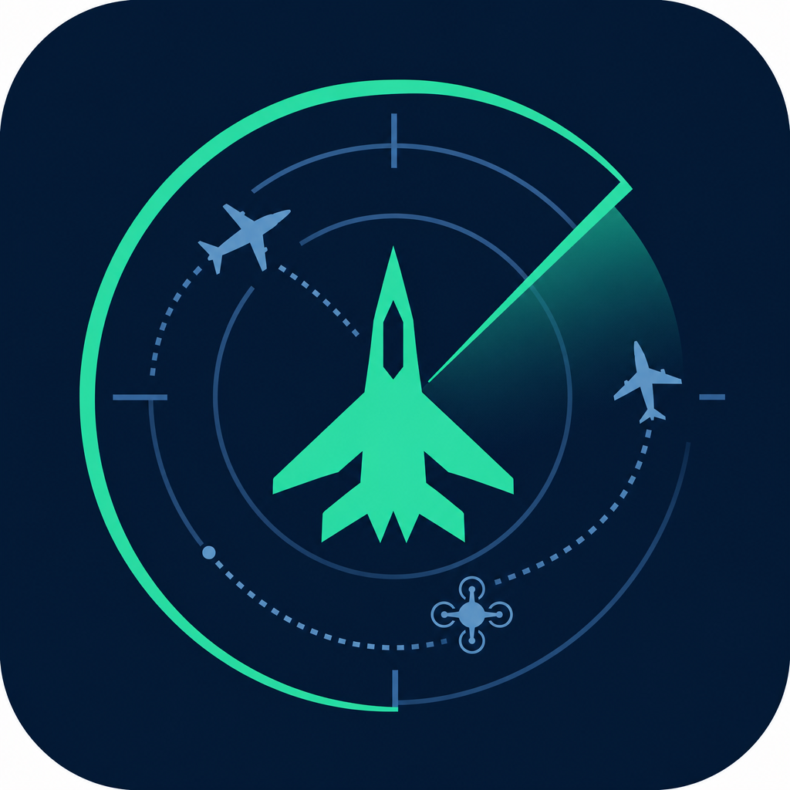
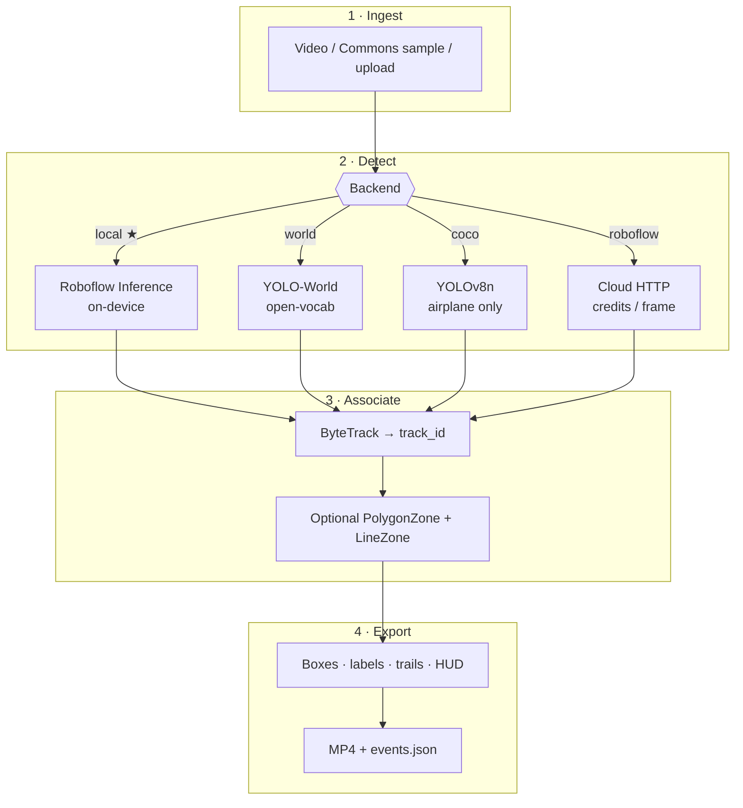
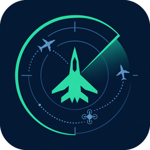

<p align="center">
  
</p>

<h1 align="center">SkyTrace</h1>

<p align="center">
  <b>Multi-object airborne tracking</b> for dense airplane traffic, hard-to-track jets, and drone activity<br/>
  <sub>Persistent IDs · motion trails · local Inference · zero private sample data required</sub>
</p>

<p align="center">
  Detect → <b>ByteTrack</b> → annotate → export<br/>
  <a href="https://supervision.roboflow.com/">Roboflow Supervision</a>
  · local <a href="https://inference.roboflow.com/">Inference</a>
  · YOLO-World
  · optional airspace zones
</p>

<p align="center">
  <a href="https://github.com/amafjarkasi/skytrace/actions/workflows/ci.yml"></a>
  <a href="https://www.python.org/"></a>
  <a href="https://supervision.roboflow.com/"></a>
  <a href="LICENSE"></a>
  
  
</p>

<p align="center">
  <a href="#-overview">Overview</a> ·
  <a href="#-use-cases">Use cases</a> ·
  <a href="#-mission">Mission</a> ·
  <a href="#-features">Features</a> ·
  <a href="#-gallery">Gallery</a> ·
  <a href="#-how-it-works">How it works</a> ·
  <a href="#-quick-start">Quick start</a> ·
  <a href="#-sample-catalog">Samples</a> ·
  <a href="#-models--backends">Models</a> ·
  <a href="#-cli-reference">CLI</a> ·
  <a href="#-configuration">Config</a> ·
  <a href="#-troubleshooting">Troubleshooting</a> ·
  <a href="#-documentation">Docs</a>
</p>

---

## 🌐 Overview

**SkyTrace** turns raw airside video into **persistent tracks** — not one-off detections. Every frame can contain several airplanes on an apron, a small UAV against bright sky, or a fast jet that only occupies a few pixels for a moment. SkyTrace runs a detector, associates boxes across time with **ByteTrack**, draws motion trails, and writes an annotated video plus a structured event log you can analyze later.

That one-line pitch — *multi-object airborne tracking for dense airplane traffic, hard-to-track jets, and drone activity* — maps to three real failure modes this repo is built to demonstrate:

| Challenge | What breaks naive demos | How SkyTrace approaches it |
| --- | --- | --- |
| **Dense airplane traffic** | Multiple overlapping airframes, parked + taxiing in one FOV | View-tuned models (`overhead_plane`, `airborne`) + multi-ID ByteTrack + trails |
| **Hard-to-track jets** | Speed, blur, abrupt scale change → ID switches | Aerial-friendly tracker thresholds and per-frame event export to audit gaps |
| **Drone activity** | Tiny / low-contrast targets that disappear between frames | Dedicated Universe drone aliases (`drone`, `tello`, …) and open-vocab YOLO-World fallback |

**What you run locally**

1. **Fetch** CC-licensed Wikimedia samples (under-shot spotting, overhead aprons, videos *of* drones — no private footage required).
2. **Detect** with local Roboflow Inference after a one-time weight download (or YOLO-World / COCO offline).
3. **Track & annotate** with Supervision (boxes, labels, traces, optional `PolygonZone` / `LineZone`).
4. **Export** `data/outputs/*_tracked.mp4` + `*.events.json` (`track_id`, class, confidence, `xyxy`, zone flags).

**Stack at a glance:** [Supervision](https://supervision.roboflow.com/) · [Roboflow Inference](https://inference.roboflow.com/) · Ultralytics YOLO-World · Gradio UI · MIT code + Commons samples ([`NOTICE.md`](NOTICE.md)).

> Prefer **`--backend local`** for long clips. Cloud HTTP (`roboflow`) bills **per frame** and is only for short checks.

---

## 🧭 Use cases

Prerequisite for all examples below (once per machine):

```powershell
.\scripts\setup_local.ps1
copy .env.example .env   # set ROBOFLOW_API_KEY=
.\.venv312\Scripts\Activate.ps1
python -m skytrace.cli fetch
```

Outputs land in `data/outputs/` as `*_tracked.mp4` + matching `*.events.json`.

---

### 1) 🛫 Dense apron traffic — multi-aircraft overhead

**Who:** airport ops demos, apron situational awareness prototypes, CV teaching labs.  
**Goal:** keep **several** airframes as separate ByteTrack IDs in a top-down / elevated apron view.  
**Why this sample:** `overhead_apron_montage.mp4` packs multiple planes into one FOV (true multi-object, not a single close-up).

```powershell
# PowerShell helper
.\scripts\run_local.ps1 `
  -Source data\videos\overhead_apron_montage.mp4 `
  -Model overhead_plane `
  -MaxFrames 0 `
  -Conf 0.25 `
  -Zones

# Equivalent CLI
python -m skytrace.cli track `
  --backend local `
  --roboflow-model overhead_plane `
  --source data/videos/overhead_apron_montage.mp4 `
  --max-frames 0 `
  --conf 0.25 `
  --zones `
  --output data/outputs/usecase_apron_multi.mp4
```

**Expect:** multiple `planes` class hits, **2–3+ unique tracks**, corridor zone HUD when `--zones` is on.  
**Read results:** open the MP4; inspect `usecase_apron_multi.events.json` → `unique_tracks`, `class_counts`, `zones`.

---

### 2) ⚡ Hard-to-track jets — spotting / under-shot pass

**Who:** plane-spotting analytics, approach-path demos, MOT stress tests.  
**Goal:** hold an ID while a jet moves fast, changes scale, or briefly softens against sky.  
**Why these samples:** under-shot takeoffs + longer RCTP spotting traffic.

```powershell
# Short under-shot jet (smoke test)
.\scripts\run_local.ps1 `
  -Source data\videos\undershot_tejas.webm `
  -Model airborne `
  -MaxFrames 0 `
  -Conf 0.2

# Longer spotting traffic (cap frames to save time)
python -m skytrace.cli track `
  --backend local `
  --roboflow-model airborne `
  --source data/videos/spotting_747_rctp.webm `
  --max-frames 150 `
  --conf 0.2 `
  --zones `
  --output data/outputs/usecase_spotting_jets.mp4

# Classic A380 under-shot with zone overlay
python -m skytrace.cli track `
  --backend local `
  --roboflow-model airborne `
  --source data/videos/undershot_a380_yyz.webm `
  --max-frames 120 `
  --zones `
  --output data/outputs/usecase_a380_zones.mp4
```

**Expect:** stable `#track_id` labels + motion trails; zone tags when the airframe enters the corridor polygon.  
**Tip:** if IDs flicker, lower `--conf` slightly (e.g. `0.15`) or keep `--zones` off while tuning detection first.

---

### 3) 🛸 Drone / small-UAV tracking

**Who:** UAS awareness demos, counter-UAS *research* prototypes (EO-only), hobbyist CV.  
**Goal:** detect and track small drones that are easy to miss with airplane-only models.  
**Why these samples:** Commons clips **of** drones (hover / Matrice / VTOL) — not FPV filmed by drones.

```powershell
# Primary drone demo (verified multi-track on hover clip)
.\scripts\run_local.ps1 `
  -Source data\videos\drone_quadcopter_hover.webm `
  -Model drone `
  -MaxFrames 0 `
  -Conf 0.15

python -m skytrace.cli track `
  --backend local `
  --roboflow-model drone `
  --source data/videos/drone_quadcopter_hover.webm `
  --max-frames 0 `
  --conf 0.15 `
  --output data/outputs/usecase_drone_hover.mp4

# Alternate hardware / viewpoints
python -m skytrace.cli track --backend local --roboflow-model drone `
  --source data/videos/drone_matrice_fire.webm --max-frames 0 --conf 0.15
python -m skytrace.cli track --backend local --roboflow-model tello `
  --source data/videos/drone_peliscu.webm --max-frames 0 --conf 0.15
python -m skytrace.cli track --backend local --roboflow-model drone_large `
  --source data/videos/drone_cobalt_vtol.webm --max-frames 0 --conf 0.15
```

**Expect:** `drone` class hits and **≥1–2 unique tracks** on the hover clip with the preferred `drone` alias.  
**Fallback (no Inference):** YOLO-World open-vocab:

```powershell
python -m skytrace.cli track `
  --backend world `
  --source data/videos/drone_quadcopter_hover.webm `
  --classes "drone,UAV,quadcopter,aircraft" `
  --max-frames 90 `
  --conf 0.1
```

---

### 4) 🛰️ Mixed airspace — planes + helicopters + drones in one pass

**Who:** “what’s in this sky clip?” explorers, open-vocab experiments.  
**Goal:** surface multiple airborne classes without committing to a single Universe model.  
**Approach:** YOLO-World (`--backend world`) with an airborne class list, or `airborne` on busy spotting video.

```powershell
# Open-vocab mixed classes (offline-friendly)
python -m skytrace.cli track `
  --backend world `
  --source data/videos/spotting_747_rctp.webm `
  --classes "airplane,jet,helicopter,drone,UAV,bird" `
  --max-frames 120 `
  --conf 0.15 `
  --output data/outputs/usecase_mixed_world.mp4

# Universe airborne model on the same spotting clip
python -m skytrace.cli track `
  --backend local `
  --roboflow-model airborne `
  --source data/videos/spotting_747_rctp.webm `
  --max-frames 150 `
  --output data/outputs/usecase_mixed_airborne.mp4
```

**Expect:** `class_counts` spanning more than one label when the clip supports it; use events JSON to histogram classes over time.

---

### 5) 📐 Airspace corridor / line-crossing analytics

**Who:** demos of Supervision zones for “did anything enter this lane?” storytelling.  
**Goal:** overlay a relative **PolygonZone** corridor + mid-frame **LineZone**, count occupancy / crossings, tag events with `in_zone`.

```powershell
python -m skytrace.cli track `
  --backend local `
  --roboflow-model overhead_plane `
  --source data/videos/overhead_apron_montage.mp4 `
  --max-frames 0 `
  --zones `
  --output data/outputs/usecase_zones_apron.mp4

# Same idea on under-shot traffic
.\scripts\run_local.ps1 `
  -Source data\videos\undershot_a380_yyz.webm `
  -Model airborne `
  -MaxFrames 120 `
  -Zones
```

**Expect:** HUD shows `zone:…` and `line:in/out`; each event may include `"in_zone": true|false`.  
**Downstream:** sum `in_zone` in the JSON, or chart `zones.line_in` / `zones.line_out` across clips.

---

### 6) 🖥️ Interactive review — Gradio operator console

**Who:** stakeholders who won’t touch a terminal; quick A/B of models.  
**Goal:** fetch samples, switch backend/alias, toggle zones, preview annotated video.

```powershell
.\.venv312\Scripts\Activate.ps1
python app.py
# open the local Gradio URL → Fetch public samples → pick clip → Run tracking
```

| UI control | Maps to |
| --- | --- |
| Backend dropdown | `--backend` |
| Model alias | `--roboflow-model` |
| Zones checkbox | `--zones` |
| Max frames `0` | full video |

---

### 7) 📊 Batch export for notebooks / dashboards

**Who:** analysts building heatmaps, track-length histograms, or class timelines.  
**Goal:** produce machine-readable events without babysitting the preview window.

```powershell
$clips = @(
  @{ src = "data/videos/overhead_apron_montage.mp4"; model = "overhead_plane"; out = "batch_apron.mp4" },
  @{ src = "data/videos/drone_quadcopter_hover.webm"; model = "drone"; out = "batch_drone.mp4" },
  @{ src = "data/videos/spotting_747_rctp.webm"; model = "airborne"; out = "batch_spotting.mp4" }
)

foreach ($c in $clips) {
  python -m skytrace.cli track `
    --backend local `
    --roboflow-model $c.model `
    --source $c.src `
    --max-frames 90 `
    --output ("data/outputs/" + $c.out)
}
```

Then load `data/outputs/*.events.json` in Python/pandas and group by `track_id` / `class`.

---

### Use-case cheat sheet

| # | Use case | Sample | Model | Key flags |
| --- | --- | --- | --- | --- |
| 1 | Dense apron multi-plane | `overhead_apron_montage.mp4` | `overhead_plane` | `--zones` |
| 2 | Hard jets / spotting | `spotting_747_rctp.webm`, `undershot_*` | `airborne` | `--max-frames`, `--zones` |
| 3 | Drone tracking | `drone_quadcopter_hover.webm` | `drone` | `--conf 0.15` |
| 4 | Mixed airspace | spotting or world classes | `airborne` / `world` | `--classes …` |
| 5 | Corridor analytics | apron or A380 | matching alias | `--zones` |
| 6 | Stakeholder UI | any | any | `python app.py` |
| 7 | Batch JSON export | several | per-clip alias | `--output` |

---

<a id="-gallery"></a>

<p align="center">
  
  
  
</p>

<p align="center">
  <sub>
    <b>Multi-plane apron</b> · <b>drone tracks</b> · <b>spotting traffic</b><br/>
    Persistent IDs across crowded frames — not a single close-up airliner screenshot.
  </sub>
</p>

---

## 🎯 Mission

**SkyTrace** is an open demo of [Roboflow Supervision](https://supervision.roboflow.com/) applied to **aerial multi-object tracking (MOT)**.

The goal is not “find one airplane.” The goal is to keep **many airborne objects** identified as they move:

| Scenario | Why it matters | What SkyTrace emphasizes |
| --- | --- | --- |
| 🛫 **Heavy airplane traffic** | Aprons & spotting ramps pack multiple airframes into one FOV | Multi-box association + trails |
| 🛸 **Drone / swarm-like activity** | Small, fast, low-contrast UAVs break naive detectors | Dedicated Universe drone aliases + ByteTrack |
| ⚡ **Hard-to-track jets** | Speed, scale jumps, brief occlusion → ID switches | Lower activation thresholds for sparse aerial dets |
| 🛰️ **Mixed airspace** | Planes + helicopters + drones + birds in one clip | Open-vocab YOLO-World *or* view-specific models |

> ⚠️ **Not ATC and not a surveillance product.** Real airport / UAS defense stacks fuse radar, RF, ADS-B, and IR. SkyTrace is EO video MOT for research and demos. See [`docs/GAPS.md`](docs/GAPS.md).

---

## ✨ Features

<table cellpadding="12" cellspacing="0">
<tr>
<td width="50%" valign="top">

### Core pipeline
- 🎬 Video ingest (bundled samples or your file)
- 🧠 Detectors: **local Inference**, YOLO-World, COCO, cloud HTTP
- 🆔 **ByteTrack** persistent IDs (`trackers` or `sv.ByteTrack`)
- 🖍️ Box + label + **motion trail** annotators
- 📐 Optional **PolygonZone** corridor + **LineZone** counters
- 📦 Annotated **MP4** + structured **`*.events.json`**

<br/><br/>

</td>
<td width="50%" valign="top">

### Product experience
- 📥 **Zero sample data** — `fetch` pulls CC Wikimedia clips
- 🖥️ **Gradio UI** (`app.py`) for interactive runs
- 💸 **Local-first cost model** — download weights once, infer on-device
- 🧪 Unit-tested model path helpers + GitHub Actions CI
- 🖼️ README gallery builder (`scripts/build_gallery.py`)
- 📜 Clear attribution in [`NOTICE.md`](NOTICE.md)

<br/><br/>

</td>
</tr>
</table>

### Feature matrix

| Capability | Status | Notes |
| --- | --- | --- |
| Multi-object tracking | ✅ | ByteTrack IDs + traces |
| Airplane / apron models | ✅ | `airborne`, `overhead_plane` |
| Drone models | ✅ | `drone`, `drone_v2`, `drone_large`, `tello` |
| Open-vocab classes | ✅ | YOLO-World (`--backend world`) |
| Zone analytics | ✅ | `--zones` |
| Gradio demo | ✅ | `python app.py` |
| Public sample fetch | ✅ | Planes + drones + overhead montage |
| ADS-B / radar fusion | ❌ | Out of scope (documented gap) |
| Multi-camera re-ID | ❌ | Out of scope |

<br/>

---

## 🔥 Why aerial MOT is hard

| Failure mode | What you see | SkyTrace response |
| --- | --- | --- |
| **Scale chaos** | Widebody + distant UAV in one frame | View-specific model aliases |
| **Motion / blur** | Jets smear; drones flicker | Confidence tuning + tracker buffers |
| **ID switches** | “Drone #3” becomes “#7” mid-clip | ByteTrack with aerial-friendly thresholds |
| **Viewpoint mismatch** | Under-shot ≠ nadir ≠ handheld UAV | Separate Universe models per view |
| **Cloud cost traps** | 3‑min spotting clip × per-frame API | Default **`local`** after weight download |

---

## 🧪 Verified local results

Runs on **Python 3.12 + local Inference** (example numbers from demo passes):

| Scenario | Model alias | Tracks / hits | Takeaway |
| --- | --- | --- | --- |
| Overhead apron montage | `overhead_plane` | **2–3** plane tracks, 100+ hits | Dense multi-aircraft geometry |
| Quadcopter hover | `drone` | **2** tracks, ~93 drone hits | Small UAV persistence |
| RCTP spotting clip | `airborne` | Multi-class airplane / heli / drone hits | Busy spotting traffic |
| A380 + zones | `airborne` + `--zones` | Corridor occupancy counters | Zone overlay analytics |

Rebuild gallery assets from your outputs:

```powershell
python scripts/build_gallery.py
```

---

## 🧠 How it works



### Step-by-step

| # | Stage | Implementation | Detail |
| --- | --- | --- | --- |
| 1 | **Ingest** | Supervision / OpenCV | `data/videos/*` or upload path |
| 2 | **Detect** | `AirborneDetector` | Alias → Universe `project/version` (workspace stripped) |
| 3 | **Track** | `ByteTrackTracker` preferred | Lower activation / IOU for sparse aerial dets |
| 4 | **Zones** | `sv.PolygonZone` + `sv.LineZone` | Relative corridor + mid-frame count line |
| 5 | **Annotate** | Box / Label / Trace + HUD | Live track count, model id, zone stats |
| 6 | **Export** | `VideoSink` + JSON | Per-frame events for analytics |

### Events JSON (shape)

```json
{
  "source": "data/videos/overhead_apron_montage.mp4",
  "model": "local:overhead-plane-detector/3",
  "backend": "local",
  "frames_processed": 90,
  "unique_tracks": 3,
  "class_counts": { "planes": 216 },
  "zones": {
    "enabled": true,
    "zone_detection_hits": 126,
    "line_in": 0,
    "line_out": 0
  },
  "events": [
    {
      "frame": 42,
      "track_id": 2,
      "class": "planes",
      "confidence": 0.81,
      "xyxy": [120.5, 80.2, 340.1, 210.0],
      "in_zone": true
    }
  ]
}
```

More architecture notes: [`docs/ARCHITECTURE.md`](docs/ARCHITECTURE.md).

---

## 🚀 Quick start

### Requirements

| Item | Recommendation |
| --- | --- |
| OS | Windows / macOS / Linux |
| Python | **3.12** for `local` Inference (3.10–3.12 supported; **not 3.13** for `inference`) |
| API key | [Roboflow](https://roboflow.com/) key in `.env` (needed once to download Universe weights) |
| Hardware | CPU works; GPU speeds Inference / YOLO |

### ✅ Path A — local Inference (recommended)

```powershell
# 1) Create .venv312 + install Inference stack
.\scripts\setup_local.ps1

# 2) Secrets
copy .env.example .env
# edit .env → ROBOFLOW_API_KEY=...

# 3) Activate + fetch public samples
.\.venv312\Scripts\Activate.ps1
python -m skytrace.cli fetch
python -m skytrace.cli status

# 4) Multi-object demos
.\scripts\run_local.ps1 -Source data\videos\overhead_apron_montage.mp4 -Model overhead_plane -MaxFrames 0 -Zones
.\scripts\run_local.ps1 -Source data\videos\drone_quadcopter_hover.webm -Model drone -MaxFrames 0
.\scripts\run_local.ps1 -Source data\videos\spotting_747_rctp.webm -Model airborne -MaxFrames 150

# 5) Interactive UI
python app.py
```

After the first weight download, frames run **on your machine** — no per-frame Roboflow detect charges.

### 🧊 Path B — offline YOLO-World (no Inference package)

Useful on Python 3.13 or air-gapped machines:

```powershell
python -m venv .venv
.\.venv\Scripts\Activate.ps1
pip install -r requirements.txt

python -m skytrace.cli fetch
python -m skytrace.cli track --backend world `
  --source data/videos/drone_quadcopter_hover.webm `
  --classes "drone,UAV,airplane,jet,helicopter,bird" `
  --max-frames 90 --conf 0.15
```

Ultralytics checkpoints land in `weights/` (gitignored).

### 🖥️ Gradio UI

```powershell
python app.py
```

| Control | Purpose |
| --- | --- |
| **Fetch public samples** | Runs the Commons catalog + overhead montage |
| **Bundled sample** | Pick a local `data/videos/*` file |
| **Upload** | Bring your own clip |
| **Backend** | `local` / `world` / `roboflow` / `coco` |
| **Model alias** | `airborne`, `overhead_plane`, `drone`, … |
| **Zones checkbox** | Polygon corridor + line counters |
| **Max frames** | `0` = full video |

---

## 📦 Sample catalog

Fetched by `python -m skytrace.cli fetch` into `data/videos/` and `data/images/`.

### Airplanes / spotting

| Local file | Kind | Notes |
| --- | --- | --- |
| `undershot_a380_yyz.webm` | Under-shot | A380 takeoff (~34s) |
| `undershot_flight_delhi.webm` | Under-shot | Ground-looking takeoff |
| `undershot_tejas.webm` | Under-shot | Short carrier takeoff smoke test |
| `spotting_747_rctp.webm` | Spotting | Longer runway / traffic clip |
| `overhead_apron_montage.mp4` | Overhead | Built from aerial apron stills |

### Drones *(videos of drones, not filmed by drones)*

| Local file | Notes |
| --- | --- |
| `drone_quadcopter_hover.webm` | Hover against sky — primary drone demo |
| `drone_matrice_fire.webm` | DJI Matrice 300RTK (~12s) |
| `drone_cobalt_vtol.webm` | VTOL demo clip |
| `drone_peliscu.webm` | Small outdoor drone clip |

Licenses & attribution: [`NOTICE.md`](NOTICE.md).

---

## 🛰️ Models & backends

### Backends

| Backend | Where it runs | Cost model | Prefer when |
| --- | --- | --- | --- |
| **`local`** ★ | Your GPU/CPU via `inference` | API key **once** for weight download → free per frame | Dense traffic / long clips |
| **`world`** | Offline Ultralytics YOLO-World | Free | Open-vocab multi-class, no Universe model |
| **`coco`** | Offline YOLOv8n | Free | Airplane-only smoke test |
| **`roboflow`** | `serverless.roboflow.com` | **Credits per frame** | Short validation only |

### Universe model aliases

| Alias | Universe model ID | Best for |
| --- | --- | --- |
| `airborne` | `airborne-object-detection/airborne-object-detection-4-aod4/6` | Spotting / under-shot airborne objects |
| `overhead_plane` | `skybot-cam/overhead-plane-detector/3` | Top-down / apron multi-plane |
| `drone` / `drone_yolo11` | `godworkspace/drone-detection-dvhol/2` | **Preferred** drone detector |
| `drone_v2` | `yolodrone/drone-object-detection-v2/1` | Alternate drone OD v2 |
| `drone_large` | `drone-detection-snemv/drone-detection-wpccn/1` | Large drone dataset (~9.6k images) |
| `tello` | `alexander437-gzzhf/tello_detect/1` | Tello-oriented clips |

Full IDs also accepted (`workspace/project/version`). Paths are normalized to `project/version` for Inference / HTTP.

### YOLO-World default classes

```
airplane, aircraft, jet, drone, UAV, helicopter, bird
```

Override with `--classes "drone,UAV,airplane"`.

---

## 🧰 CLI reference

| Command | Description |
| --- | --- |
| `python -m skytrace.cli fetch [--force]` | Download Commons samples + build overhead montage |
| `python -m skytrace.cli list` | List files in `data/videos/` |
| `python -m skytrace.cli status` | Show API key, Inference availability, aliases |
| `python -m skytrace.cli track ...` | Full detect → track → annotate → JSON |
| `python app.py` | Launch Gradio |
| `python scripts/build_gallery.py` | Rebuild `docs/assets/*.gif` from outputs |
| `scripts\skytrace312.cmd <args>` | Windows helper into `.venv312` |

### `track` flags

```text
--source PATH              Input video (default: first local sample)
--output PATH              Output MP4 (default: data/outputs/<stem>_tracked.mp4)
--backend local|world|coco|roboflow|auto
--roboflow-model ALIAS|ID  airborne | overhead_plane | drone | …
--classes LIST             YOLO-World classes (comma-separated)
--conf FLOAT               Confidence threshold (default ~0.15)
--max-frames N             Cap frames; ≤0 means full video
--zones                    Enable PolygonZone + LineZone overlays
--preview                  OpenCV preview window (press q to quit)
```

### PowerShell helper

```powershell
.\scripts\run_local.ps1 `
  -Source data\videos\overhead_apron_montage.mp4 `
  -Model overhead_plane `
  -MaxFrames 0 `
  -Conf 0.25 `
  -Zones
```

---

## ⚙️ Configuration

| Variable / path | Role |
| --- | --- |
| `ROBOFLOW_API_KEY` | Universe weight download (`local`) or cloud detect (`roboflow`) |
| `.env` | Loaded automatically; **gitignored** |
| `data/videos/` | Fetched samples (contents gitignored) |
| `data/outputs/` | Annotated MP4 + events JSON (gitignored) |
| `weights/` | Ultralytics checkpoints (gitignored; `.gitkeep` kept) |
| `docs/assets/` | Logo + gallery GIFs (**tracked**) |

Copy `.env.example` → `.env`:

```env
ROBOFLOW_API_KEY=
```

---

## 🗂️ Repository layout

```text
skytrace/                         # GitHub repo root
├── app.py                        # Gradio entrypoint
├── pyproject.toml                # package name: skytrace
├── requirements.txt              # core / offline stack
├── requirements-local.txt        # Inference + Gradio (3.12)
├── LICENSE · NOTICE.md · README.md
├── skytrace/                     # Python package
│   ├── pipeline.py               # detect + ByteTrack + zones + annotate
│   ├── roboflow_http.py          # cloud HTTP + path normalize
│   ├── samples.py                # Commons catalog + montage
│   ├── config.py                 # env, aliases, paths
│   └── cli.py                    # fetch / track / list / status
├── scripts/
│   ├── setup_local.ps1           # create .venv312 + install
│   ├── run_local.ps1             # one-liner local track
│   ├── fetch_samples.py
│   ├── build_gallery.py
│   └── skytrace312.cmd
├── tests/                        # pytest (no network)
├── docs/
│   ├── assets/                   # logo + multi-object GIFs
│   ├── ARCHITECTURE.md
│   ├── GAPS.md
│   └── design/
├── data/                         # videos · images · outputs
├── weights/                      # YOLO / caches
└── .github/workflows/ci.yml      # pytest on 3.11 / 3.12
```

---

## 🛠️ Development

```powershell
.\.venv312\Scripts\Activate.ps1
pip install -e ".[dev]"
pytest -q
```

CI runs the same unit tests on push/PR (Python 3.11 & 3.12).

---

## 🩺 Troubleshooting

| Symptom | Likely cause | Fix |
| --- | --- | --- |
| `inference` import fails on 3.13 | Unsupported Python | Use `.venv312` / Python 3.10–3.12 |
| `ROBOFLOW_API_KEY missing` | No `.env` | Copy `.env.example`, set key |
| 0 tracks on drone clip | Wrong model / conf | Use `--roboflow-model drone`, try `--conf 0.15` |
| Cloud bill spike | `--backend roboflow` on long video | Switch to `local` |
| Wikimedia 403 on fetch | Missing User-Agent | Use project `fetch` (sets UA) — don’t curl raw |
| Huge root `*.pt` files | Ultralytics download cwd | Weights should land in `weights/` (current pipeline) |
| Empty / tiny output MP4 | Corrupt write / 0 frames | Check `--max-frames`, source path, `status` |

---

## 📚 Documentation

| Doc | Contents |
| --- | --- |
| [`docs/ARCHITECTURE.md`](docs/ARCHITECTURE.md) | Modules, data flow, zone policy, JSON schema |
| [`docs/GAPS.md`](docs/GAPS.md) | ADS-B / radar / multimodal gaps vs production |
| [`docs/design/2026-07-11-air-tracking-demo-design.md`](docs/design/2026-07-11-air-tracking-demo-design.md) | Original design brief |
| [`NOTICE.md`](NOTICE.md) | Sample licenses + Universe model IDs |
| [Supervision docs](https://supervision.roboflow.com/) | Upstream annotators, trackers, zones |
| [Inference docs](https://inference.roboflow.com/) | On-device / edge deployment |

---

## 🔐 Security & cost

- 🗝️ Store `ROBOFLOW_API_KEY` only in `.env` (never commit)
- 💸 Prefer **`local`** so spotting videos don’t burn per-frame credits
- 🔄 Rotate any key that was pasted into chat, tickets, or CI logs
- 📜 Sample media remains under upstream Commons / GODL terms

---

## 📄 License

| Asset | License |
| --- | --- |
| SkyTrace code | [MIT](LICENSE) |
| Demo media | Upstream Commons / GODL — see [`NOTICE.md`](NOTICE.md) |
| Model weights | Subject to Ultralytics / Roboflow Universe terms on download |

---

<p align="center">
  <br/><br/>
  <b>SkyTrace</b> — multi-object aerial MOT with
  <a href="https://supervision.roboflow.com/">Supervision</a><br/>
  <sub>Dense traffic · drones · hard jets — not a single-plane screenshot demo.</sub><br/><br/>
  <a href="https://github.com/amafjarkasi/skytrace">github.com/amafjarkasi/skytrace</a>
</p>
