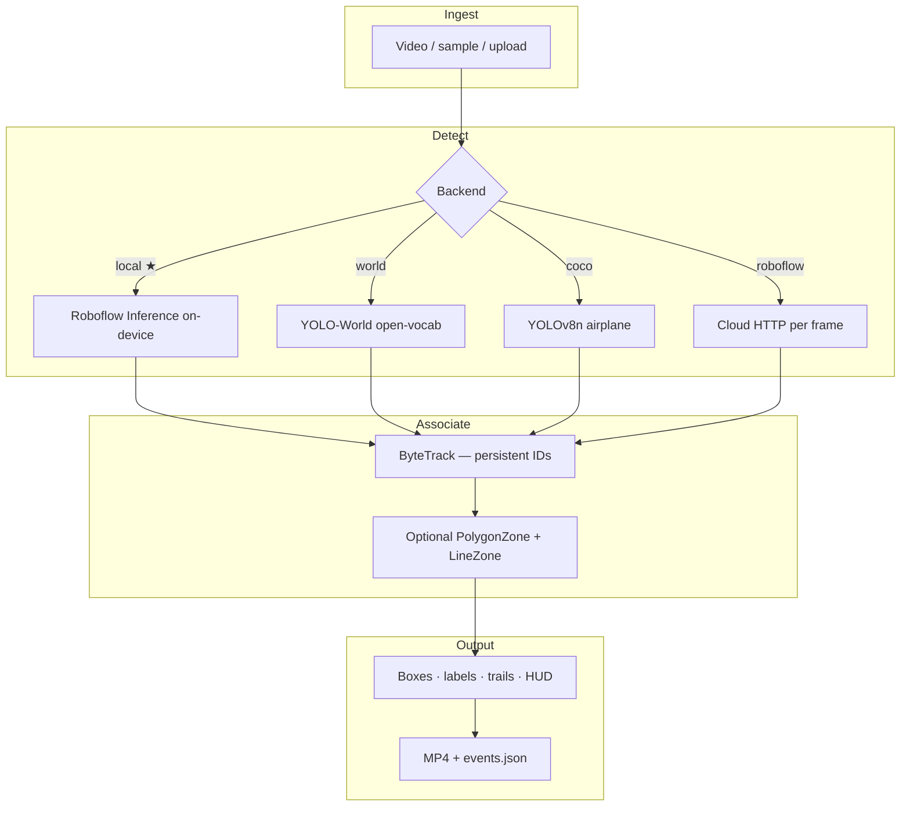

<p align="center">
  
</p>

<h1 align="center">SkyTrace</h1>

<p align="center">
  <strong>Multi-object airborne tracking</strong> for dense traffic, fast jets, and drone activity<br/>
  Built on <a href="https://supervision.roboflow.com/">Roboflow Supervision</a> · local Inference · ByteTrack · optional airspace zones
</p>

<p align="center">
  <a href="https://github.com/amafjarkasi/skytrace/actions"></a>
  
  
  
  
</p>

<p align="center">
  <a href="#-mission">Mission</a> ·
  <a href="#-why-this-is-hard">Why hard</a> ·
  <a href="#-how-it-works">How it works</a> ·
  <a href="#-quick-start">Quick start</a> ·
  <a href="#-models--backends">Models</a> ·
  <a href="#-documentation">Docs</a>
</p>

---

<p align="center">
  
  
  
</p>

<p align="center"><sub>
  Left → right: <b>multi-plane apron</b> · <b>drone tracks</b> · <b>spotting traffic</b> (multi-class hits).<br/>
  Not a single close-up airliner hero shot — the point is <b>many objects, hard geometry, persistent IDs</b>.
</sub></p>

---

## 🎯 Mission

**SkyTrace** is a Supervision-powered demo for **tracking many things in the sky at once**:

| Challenge | What SkyTrace targets |
| --- | --- |
| 🛫 **Heavy airplane traffic** | Apron / spotting scenes with multiple airframes sharing the frame |
| 🛸 **Drone activity** | Small, fast, low-contrast UAVs (quads, VTOL, operational drones) |
| ⚡ **Hard-to-track jets** | Fast motion, scale jumps, brief occlusions — keep an ID across frames |
| 🛰️ **Mixed airspace** | Planes + drones + helicopters + birds in one open-vocab or multi-model pipeline |

It is **not** “draw one box on a big A380.” The product story is **multi-object tracking (MOT)** under aerial stress: crowded frames, tiny targets, and unstable viewpoints.

### What you get out of the box

- 🎞️ **Public CC samples** — under-shot, overhead montages, and *videos of drones* (no private footage required)
- 🧠 **Detectors** — local Roboflow Inference (preferred), YOLO-World, COCO fallback, or cloud HTTP
- 🆔 **ByteTrack** — stable track IDs + motion trails via Supervision annotators
- 📐 **Optional zones** — `PolygonZone` corridor + `LineZone` crossing counters (`--zones`)
- 📦 **Exports** — annotated MP4 + structured `*.events.json` for analytics
- 🖥️ **Gradio UI** — fetch samples, pick model alias, run, preview

> ⚠️ **Not ATC / not a surveillance product.** Research & demo software. Real airport UAS defense is multimodal (radar, RF, ADS-B, IR) — see [`docs/GAPS.md`](docs/GAPS.md).

---

## 🔥 Why this is hard

Aerial MOT fails for boring engineering reasons that still break demos:

1. **Scale chaos** — a parked widebody and a distant UAV can share one frame at wildly different pixel sizes.
2. **Motion blur & low contrast** — jets and drones against bright sky / cluttered apron.
3. **ID switches** — without tracking, every frame is a new object; with weak association, “drone #3” becomes “drone #7.”
4. **Viewpoint mismatch** — under-shot spotting ≠ nadir apron ≠ handheld drone footage → different Universe models.
5. **Cost traps** — naive cloud detect on a 3‑minute spotting clip burns credits every frame.

SkyTrace’s defaults push **on-device Inference after one weight download**, multi-object ByteTrack, and **view-specific model aliases** (`airborne`, `overhead_plane`, `drone`, …).

---

## 🧪 Live demo results (local Inference)

| Scenario | Alias | Tracks / hits (example run) | Why it matters |
| --- | --- | --- | --- |
| 🛬 Overhead apron montage | `overhead_plane` | **2–3 plane tracks**, 100+ class hits | Dense multi-aircraft geometry |
| 🛸 Quadcopter hover | `drone` | **2 tracks**, ~93 drone hits | Small UAV persistence |
| 📡 RCTP spotting clip | `airborne` | Multi-class hits (airplane / heli / drone) | Busy spotting traffic |
| ✈️ A380 + zones | `airborne` + `--zones` | Corridor occupancy counters | Zone analytics overlay |

Rebuild GIFs anytime:

```powershell
python scripts/build_gallery.py
```

---

## 🧠 How it works



### Pipeline (detail)

| Step | Tech | Notes |
| --- | --- | --- |
| 1. Ingest | OpenCV / Supervision video sink | Bundled Commons clips or your file |
| 2. Detect | Inference / Ultralytics / HTTP | Alias picks Universe project/version |
| 3. Track | `trackers.ByteTrackTracker` or `sv.ByteTrack` | Tuned for **sparse aerial** dets |
| 4. Zones | `sv.PolygonZone` + `sv.LineZone` | Corridor + crossing counts |
| 5. Annotate | Box / Label / Trace + HUD | Track count, model id, zone stats |
| 6. Export | MP4 + JSON | Per-detection `track_id`, `xyxy`, `in_zone` |

Events schema (abbrev.):

```json
{
  "unique_tracks": 3,
  "class_counts": {"planes": 216},
  "zones": {"enabled": true, "zone_detection_hits": 126, "line_in": 0, "line_out": 0},
  "events": [
    {"frame": 42, "track_id": 2, "class": "planes", "confidence": 0.81, "xyxy": [..], "in_zone": true}
  ]
}
```

---

## 🚀 Quick start

### ✅ Recommended: local Inference (Python 3.12)

```powershell
# one-time
.\scripts\setup_local.ps1
copy .env.example .env    # set ROBOFLOW_API_KEY=

.\.venv312\Scripts\Activate.ps1
python -m skytrace.cli fetch
python -m skytrace.cli status

# multi-object demos
.\scripts\run_local.ps1 -Source data\videos\overhead_apron_montage.mp4 -Model overhead_plane -MaxFrames 0 -Zones
.\scripts\run_local.ps1 -Source data\videos\drone_quadcopter_hover.webm -Model drone -MaxFrames 0
.\scripts\run_local.ps1 -Source data\videos\spotting_747_rctp.webm -Model airborne -MaxFrames 150

python app.py
```

Weights download **once** (API key authorizes Universe pull). After that, frames run **on your machine** — no per-frame Roboflow detect bill.

### 🧊 Offline fallback (YOLO-World / no Inference package)

```powershell
.\.venv\Scripts\Activate.ps1
pip install -r requirements.txt
python -m skytrace.cli track --backend world `
  --source data/videos/drone_quadcopter_hover.webm `
  --classes "drone,UAV,airplane,helicopter,bird" `
  --max-frames 90
```

---

## 🧰 CLI cheat sheet

| Command | What it does |
| --- | --- |
| `python -m skytrace.cli fetch` | 📥 Download plane + drone Commons assets; build overhead montage |
| `python -m skytrace.cli list` | 📂 List `data/videos/` |
| `python -m skytrace.cli status` | 🔑 Key / Inference / aliases |
| `python -m skytrace.cli track --source PATH [--zones]` | 🏃 Detect → track → annotate → JSON |
| `python app.py` | 🖥️ Gradio UI |
| `python scripts/build_gallery.py` | 🖼️ Rebuild README GIFs from `data/outputs/` |

Useful flags: `--backend local|world|coco|roboflow` · `--roboflow-model <alias>` · `--max-frames N` (`≤0` = full) · `--zones` · `--preview`

---

## 🛰️ Models & backends

### Backends

| Backend | Runs | 💸 Cost model | Best for |
| --- | --- | --- | --- |
| **`local`** ★ | GPU/CPU | Key once → free per frame | Dense traffic demos, long clips |
| **`world`** | Offline | Free | Open-vocab multi-class without Universe |
| **`coco`** | Offline | Free | Airplane-only smoke test |
| **`roboflow`** | Cloud | **Credits / frame** | Tiny validation only |

### Universe aliases

| Alias | Role | Typical scene |
| --- | --- | --- |
| `airborne` | General airborne OD | Spotting / under-shot jets |
| `overhead_plane` | Top-down planes | Apron / multi-aircraft overhead |
| `drone` (= `drone_yolo11`) | Preferred UAV detector | Quads / small drones |
| `drone_v2` / `drone_large` / `tello` | Alternate UAV models | Ablations / harder clips |

Full IDs + media licenses: [`NOTICE.md`](NOTICE.md).

---

## 🗂️ Repository layout

```text
skytrace/
├── app.py                  # Gradio
├── skytrace/               # detect · track · zones · samples · CLI
├── scripts/                # setup_local · run_local · fetch · gallery
├── tests/                  # fast unit tests (no network)
├── docs/
│   ├── assets/             # logo + multi-object GIFs
│   ├── ARCHITECTURE.md
│   ├── GAPS.md
│   └── design/
├── data/                   # videos / images / outputs  (gitignored contents)
├── weights/                # YOLO checkpoints           (gitignored contents)
└── .github/workflows/ci.yml
```

Root stays thin on purpose. Runtime junk (`*.pt`, caches, sample videos, outputs) is gitignored — see `.gitignore`.

---

## 📚 Documentation

| Doc | Contents |
| --- | --- |
| [`docs/ARCHITECTURE.md`](docs/ARCHITECTURE.md) | Modules, zone math, JSON schema |
| [`docs/GAPS.md`](docs/GAPS.md) | ADS-B fusion, radar/RF, what we intentionally skip |
| [`docs/design/…`](docs/design/2026-07-11-air-tracking-demo-design.md) | Original design brief |
| [`NOTICE.md`](NOTICE.md) | Commons attribution + Universe model IDs |

---

## 🔐 Security

- 🗝️ Keep `ROBOFLOW_API_KEY` in `.env` only (never commit)
- 💸 Prefer `local` so spotting videos don’t melt cloud credits
- 🔄 Rotate any key that appeared in chat / logs

---

## 📄 License

- **Code:** [MIT](LICENSE)
- **Sample media:** upstream Commons / GODL — [`NOTICE.md`](NOTICE.md)

---

<p align="center">
  <sub>
    SkyTrace · multi-object aerial MOT with <a href="https://supervision.roboflow.com/">Supervision</a><br/>
    Built for dense traffic, drones, and hard jets — not a single-plane screenshot demo.
  </sub>
</p>
