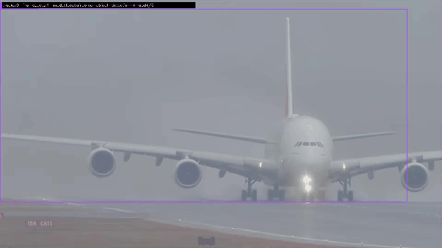
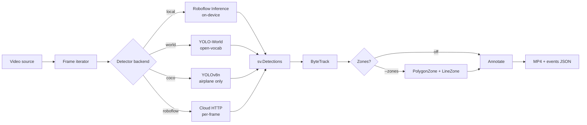

<div align="center">

# SkyTrace

**Airborne object detection & multi-object tracking**  
powered by [Roboflow Supervision](https://supervision.roboflow.com/) · local Inference · YOLO-World

[](.github/workflows/ci.yml)
[](https://www.python.org/)
[](https://supervision.roboflow.com/)
[](LICENSE)

*No private footage required — fetch CC-licensed under-shot, overhead, and drone samples and track in minutes.*

</div>

<p align="center">
  
  
</p>

---

## What is SkyTrace?

**SkyTrace** turns airport spotting clips, apron overhead imagery, and **drone footage** into tracked detections: boxes, trail overlays, stable track IDs, optional zone/line counters, and a per-frame event log.

| | |
| --- | --- |
| **Python package** | `skytrace` (`python -m skytrace.cli` / `skytrace`) |
| **UI** | Gradio (`app.py`) |
| **Outputs** | Annotated MP4 + `*.events.json` |
| **Samples** | Wikimedia Commons — see [`NOTICE.md`](NOTICE.md) |

---

## How it works



1. **Ingest** — Bundled sample or your own video.
2. **Detect** — Local Inference (preferred), YOLO-World, COCO, or cloud HTTP.
3. **Track** — `ByteTrackTracker` (tuned for sparse aerial hits) or `sv.ByteTrack`.
4. **Zones (optional)** — Corridor `PolygonZone` + mid-frame `LineZone` crossing counts.
5. **Export** — Annotated MP4 + structured events JSON.

### Detection backends

| Backend | Runs where | Cost model | Best for |
| --- | --- | --- | --- |
| **`local`** ★ | Your GPU/CPU | API key once to download weights; then free per frame | Real demos, long clips |
| **`world`** | Offline | Free | Multi-class without Universe models |
| **`coco`** | Offline | Free | Airplane-only smoke tests |
| **`roboflow`** | Cloud HTTP | **Credits per frame** | Short validation only |

### Model aliases

| Alias | Use case |
| --- | --- |
| `airborne` | General airborne / under-shot spotting |
| `overhead_plane` | Apron / top-down planes |
| `drone` | Drone OD v2 ([Universe](https://universe.roboflow.com/yolodrone/drone-object-detection-v2/model/1)) |
| `drone_yolo11` | Newer YOLOv11 drone detector |
| `drone_large` | Large public drone dataset model |
| `tello` | Tello-oriented drone detector |

---

## Quick start

### Local Inference (recommended)

```powershell
.\scripts\setup_local.ps1
# Copy .env.example → .env and set ROBOFLOW_API_KEY

.\.venv312\Scripts\Activate.ps1
python -m skytrace.cli fetch
python -m skytrace.cli status

.\scripts\run_local.ps1 -Source data\videos\undershot_a380_yyz.webm -MaxFrames 120 -Model airborne
.\scripts\run_local.ps1 -Source data\videos\overhead_apron_montage.mp4 -Model overhead_plane -MaxFrames 0 -Zones
.\scripts\run_local.ps1 -Source data\videos\drone_quadcopter_hover.webm -Model drone -MaxFrames 0

python app.py
```

### Offline fallback

```powershell
.\.venv\Scripts\Activate.ps1
pip install -r requirements.txt
python -m skytrace.cli track --backend world --source data/videos/undershot_tejas.webm --max-frames 60
```

---

## CLI

| Command | Purpose |
| --- | --- |
| `python -m skytrace.cli fetch` | Download CC samples (planes + drones) + overhead montage |
| `python -m skytrace.cli list` | List local videos |
| `python -m skytrace.cli status` | Key / Inference / model aliases |
| `python -m skytrace.cli track --source PATH [--zones]` | Detect → track → annotate → JSON |
| `python app.py` | Gradio UI |
| `python scripts/build_gallery.py` | Rebuild README GIFs from outputs |

---

## Repository layout

```
skytrace/                 # Python package
├── pipeline.py           # detect + ByteTrack + zones + annotate
├── roboflow_http.py
├── samples.py
├── config.py
└── cli.py
app.py                    # Gradio
scripts/                  # setup_local, run_local, build_gallery, …
docs/                     # architecture, gaps, assets/
data/videos/              # fetched samples (gitignored)
data/outputs/             # annotated MP4 + events (gitignored)
.github/workflows/ci.yml  # pytest on 3.11 / 3.12
```

---

## Documentation

| Doc | Contents |
| --- | --- |
| [`docs/ARCHITECTURE.md`](docs/ARCHITECTURE.md) | Modules, data flow, zones, config |
| [`docs/GAPS.md`](docs/GAPS.md) | Research gaps vs ATC / multimodal systems |
| [`NOTICE.md`](NOTICE.md) | Sample media + model attribution |

---

## Security

- Keep `ROBOFLOW_API_KEY` in `.env` only (gitignored).
- Prefer `local` over `roboflow` so long videos do not burn cloud credits.
- If a key was pasted into chat or logs, **rotate it** in the Roboflow dashboard.

---

## License

- **Code:** [MIT](LICENSE)
- **Sample media:** retain upstream Commons licenses — see [`NOTICE.md`](NOTICE.md)

---

<div align="center">

Built to showcase [Supervision](https://supervision.roboflow.com/) on real airborne imagery — not a certified ATC or surveillance product.

</div>
